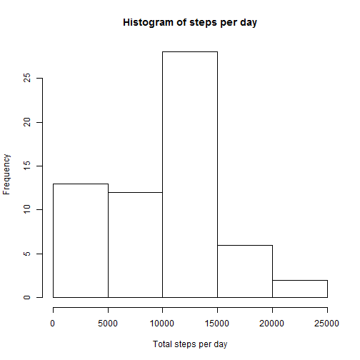
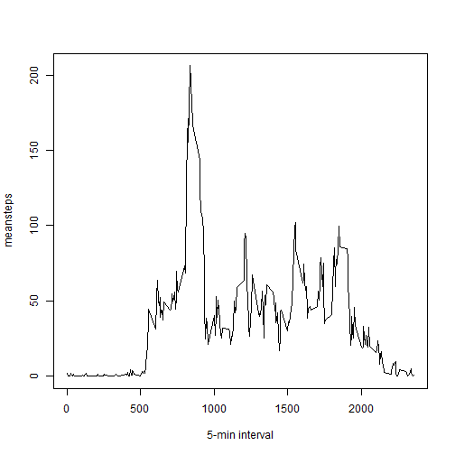
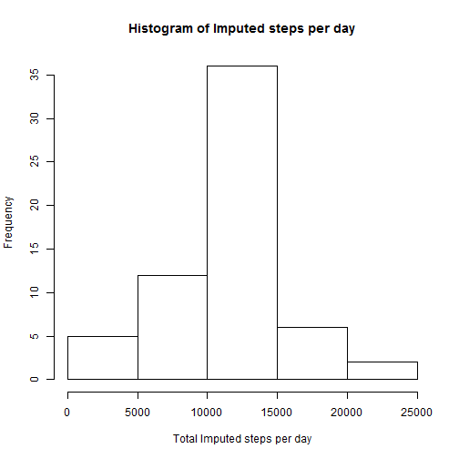

title "Ässignment"
---
title: "Reproducible Research: Peer Assessment 1"
output: 
  html_document:
    keep_md: true
---

```r
echo = TRUE

#  LOADING and PRE PROCESSING THE DATA #
activity <- NULL
activity <- read.csv("activity.csv", header = T, sep = ",")
activity$date <- as.Date(activity$date, "%Y-%m-%d")

# Histogram of the total number of steps taken each day #
echo = TRUE
totsteps <- tapply(activity$steps, activity$date, sum, na.rm=T)
echo = TRUE
hist(totsteps, xlab = "Total steps per day", main = "Histogram of steps per day")
```



```r
# Mean and median number of steps taken each day #
echo = TRUE
sorter <- activity[with(activity,order(date)),]
meansteps <- tapply(sorter$steps, activity$date, mean, na.rm=T)
mediansteps <- tapply(sorter$steps, activity$date, median, na.rm=T)

# Time series plot of the average number of steps taken #
echo = TRUE
library(dplyr)

AvgInterval <- activity %>% group_by(interval) %>%
    summarize(meansteps = mean(steps, na.rm = T))

plot(AvgInterval, type="l", xlab = "5-min interval")
```



```r
# MAX Time Interval #
echo = TRUE
maxinterval <- activity %>% summarize(maxsteps = max(steps, na.rm = T))
print(c("Interval value that contains maximum steps =", maxinterval))
```

```
## [[1]]
## [1] "Interval value that contains maximum steps ="
## 
## $maxsteps
## [1] 806
```

```r
# Code to describe and show a strategy for imputing missing data #

echo = TRUE
table(is.na(activity) == TRUE)
```

```
## 
## FALSE  TRUE 
## 50400  2304
```

```r
Imputedata <- activity

#### IMPUTING NA Interval values with the MEAN of the intervals with non NA values. ###

for (i in 1:nrow(Imputedata)) {
      if (is.na(Imputedata$steps[i])) {
            index <- Imputedata$interval[i]
            value <- subset(AvgInterval, interval==index)            
            Imputedata$steps[i] <- value$meansteps
      }
}
head(Imputedata)
```

```
##       steps       date interval
## 1 1.7169811 2012-10-01        0
## 2 0.3396226 2012-10-01        5
## 3 0.1320755 2012-10-01       10
## 4 0.1509434 2012-10-01       15
## 5 0.0754717 2012-10-01       20
## 6 2.0943396 2012-10-01       25
```

```r
echo = TRUE
totsteps2 <- tapply(Imputedata$steps, activity$date, sum, na.rm=T)
hist(totsteps2, xlab = "Total Imputed steps per day", main = "Histogram of Imputed steps per day")
```



```r
# Weekend Weekday Panel #
echo = TRUE

library(dplyr)
library(ggplot2)
Imputedata$day <- ifelse(weekdays(Imputedata$date) %in% c("Saturday", "Sunday"), "weekend", "weekday")
wkend <- filter(Imputedata, day == "weekend")
wkday <- filter(Imputedata, day == "weekday")
wkend <- wkend %>%
      group_by(interval) %>%
      summarize(mean.steps = mean(steps)) 
wkend$day <- "weekend"

wkday <- wkday %>%
      group_by(interval) %>%
      summarize(mean.steps = mean(steps)) 
wkday$day <- "weekday"

newInterval <- rbind(wkend, wkday)

g <- ggplot (newInterval, aes (interval, mean.steps))
g + geom_line() + facet_grid (day~.) + theme(axis.text = element_text(size = 12), 
      axis.title = element_text(size = 14)) + labs(y = "Number of Steps") + labs(x = "Interval")
```


